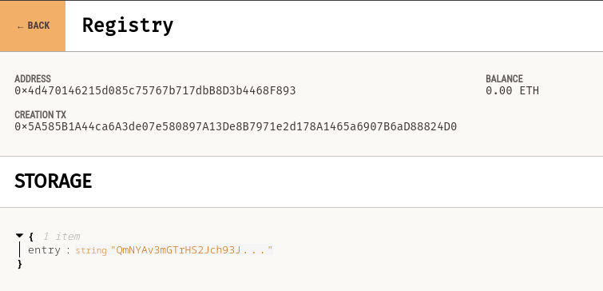

# Shuttle
Adds file to IPFS node and pushes it's CID to a ETH smart contract.

## Test
Open a terminal and run an IPFS node.
Default connection is `127.0.0.1:5001`:
```sh
ipfs daemon
```
Open a terminal and run ganache, use the mnemonic to make default values work.
Default connection is `localhost:8545`.
```sh
ganache-cli -m "hamster coin cup brief quote trick stove draft hobby strong caught unable"
```
Deploy contract on ETH network, standard setting can be found in `/contract/truffle-config.js`.
Default contract address is `0x4d470146215d085c75767b717dbB8D3b4468F893`.
```
cd contract;
truffle migrate --reset
```
Run Shuttle:
```sh
cargo run -- <FILE_NAME>
```

You can check that the value for the CID has changed by using `truffle console` query the contract.
```sh
➜ truffle console
truffle(development)> const c = await Registry.deployed()
undefined
truffle(development)> await c.getCID()
'QmNYAv3mGTrHS2Jch93JYVSv5yX3EDhvJUNyTYYtdbqgGs'
truffle(development)>
```
Using ganache-bin
Before upload it should be empty on a new contract.
After upload:



## Usage
```sh
Usage: shuttle [OPTIONS] <PATH>

Arguments:
  <PATH>

Options:
      --ipfs-port <IPFS_PORT>  IPFS HTTP port [default: 5001]
      --ipfs-host <IPFS_HOST>  IPFS HTTP ip [default: 127.0.0.1]
      --eth-port <ETH_PORT>    [default: 8545]
      --eth-host <ETH_HOST>    [default: localhost]
      --addr <ADDR>            [default: 0x4d470146215d085c75767b717dbB8D3b4468F893]
  -d, --debug                  Print debug logs
  -h, --help                   Print help information
```
